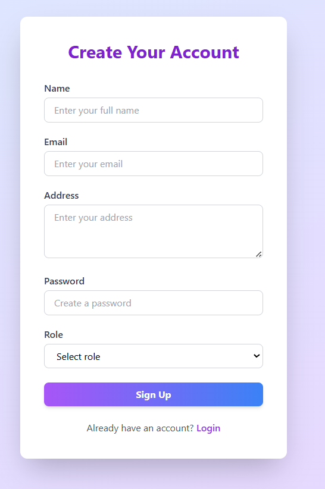
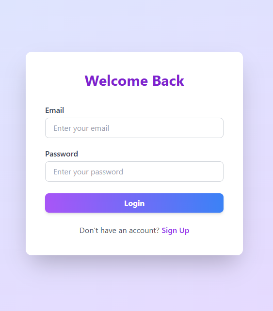
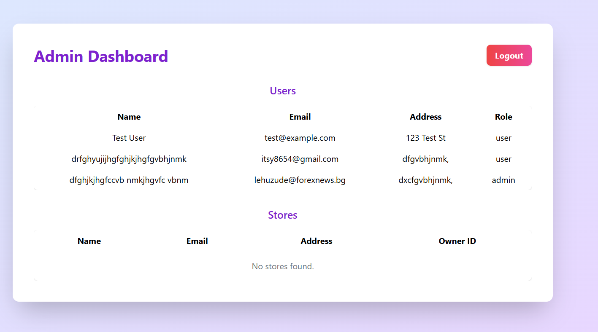
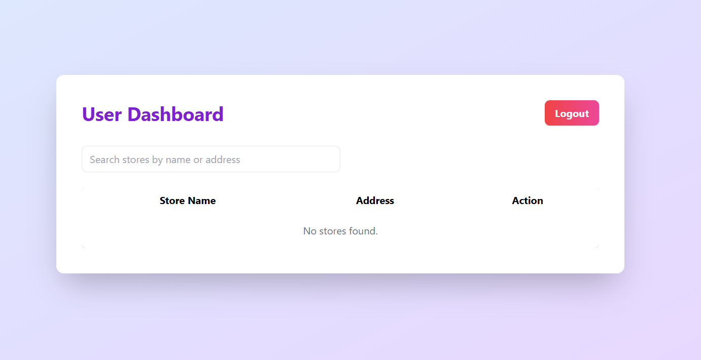
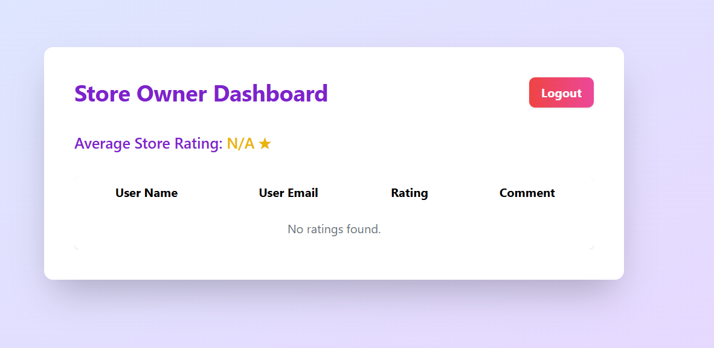

🏪 Store Rating Platform:

A full-stack web application for managing stores, users, and ratings, with role-based dashboards for Admin, Normal User, and Store Owner.

🚀 Tech Stack:

Frontend: ReactJS + Tailwind CSS
Backend: ExpressJS (Node.js)
Database: MySQL (Workbench)
API: RESTful, JWT Authentication

✨ Features:

User Roles: Admin, Normal User, Store Owner
Authentication: Secure signup & login with JWT
Admin Dashboard:
View stats (users, stores, ratings)
Add/view/filter users and stores
Add admin, user, or store owner accounts
User Dashboard:
View/search stores
Submit and update ratings
See your own ratings
Store Owner Dashboard:
See users who rated your store
View average store rating
Password Update & Logout for all roles
Form validation (Yup + React Hook Form)
Role-based route protection

Screenshots:

*Sign up page*

*Login page*

*Admin page*

*User page*

*Owner page*

🔑 API Endpoints:

Method	Endpoint	Description	Auth Required	Role.  
POST	/api/users	Register new user	No.  
POST	/api/login	Login, returns JWT	No.  
GET	/api/users	Get all users.  
GET	/api/stores	Get all stores.  
POST	/api/stores	Add a new store.  
POST	/api/ratings	Submit/update a rating.  
GET	/api/ratings/:storeId	Get ratings for a store.  
GET	/api/owner/ratings	Get ratings for owner’s stores.  
POST	/api/update-password	Update password.  
For protected routes, add header:.  
Authorization: Bearer <your_token>

📝 Validation Rules:

Name: 20–60 chars
Email: Valid email
Address: Max 400 chars
Password: 8–16 chars, 1 uppercase, 1 special char
Role: admin, user, owner

💡 Notes:

All dashboards are protected by role.
Passwords are hashed in the database.
All forms have client-side and server-side validation.
You can use Postman to test all APIs.

Built with ❤️ by Meeth Luniya
